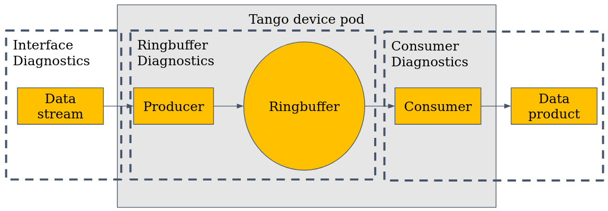

MccsDaqReceiver Diagnostic Attributes
=====================================

This document details the available diagnostic attributes on the DAQ.

These metrics are placed at one of three steps in the DAQ:

1. Interface Diagnostics - These are measuring the data over the virtualised interface the DAQ pod has mounted. 
   This means it only sees data directed to it.
2. Ringbuffer Diagnostics - These measure the capacity and performance of the ringbuffer. 
   The producer captures data and writes it into the ring buffer, and the consumer pulls from it. 
   If the consumer is slower than the producer, the buffer will fill up. 
   Once the ring buffer is full, packets are dropped until there is space again.
3. Consumer Diagnostics - These measure the performance of the consumers pulling from the ringbuffer. 
   Typically these will show issues if the ringbuffer is filling up.

Interface Diagnostics
---------------------

.. attribute:: dataRate

   **Type:** DevFloat

   **Unit:** Gb/s

   Data rate measured over the DAQ interface, independent of the DaqReceiver component.

   For the station beam, the expected data rate per Hz of bandwidth may be calculated as:

.. math::

   \underbrace{\frac{32}{27}}_{\text{Oversampling}}
   \times
   \underbrace{2}_{\text{Polarisations}}
   \times
   \underbrace{2}_{\text{Real/Imag}}
   \times
   \underbrace{\frac{8290}{8192}}_{\text{SPEAD overhead}}
   \approx 4.79 \ \text{(b/(s*Hz))}

which gives a data rate for maximum bandwidth of:

.. math::

   \frac{4.79\ \text{(b/(s*Hz))}
   \times
   300 \times 10^6\ \text{Hz}}
   {1024^3\ \text{(b/Gb)}}
   \approx 1.340\ \text{(Gb/s)}

.. attribute:: receiveRate

   **Type:** DevFloat

   **Unit:** packet/s

   Rate of packets received over the DAQ interface. This metric is independent of the DaqReceiver.

.. attribute:: dropRate

   **Type:** DevFloat

   **Unit:** packet/s 

   Rate at which packets are being dropped at the DAQ interface.
   Dropping may occur due to buffer overflows or network congestion.

Ringbuffer Diagnostics
----------------------

.. attribute:: RingbufferOccupancy

   **Type:** DevFloat

   **Unit:** % 

   Percentage of ringbuffer currently in use. When this approaches 100%, incoming packets are at risk of being dropped
   because the consumer is not processing data fast enough.

.. attribute:: LostPushes

   **Type:** DevLong 

   Total number of failed attempts to push data into the ringbuffer.
   This typically increases when the buffer is full or consumer lag is high.

Consumer Diagnostics
--------------------

.. attribute:: nofSaturations

   **Type:** DevLong 

   Number of saturation events recorded during the most recent integration by the station beam consumer.

.. attribute:: nofPackets

   **Type:** DevLong

    Total number of packets processed during the last integration by the data consumer.

    1. For the station beam consumer this is dependent on the integration time, the higher the integation time
       the more packets we expect per integration. (nof_station_samples * nof_channels / 2048)
    2. For the xGPU correlator data consumer, this at the moment should be 1835008/128 per TPM as each packet contains 128 samples, and nof samples is fixed to 1835008. 
       Note: there is some odd behaviour with this attribute at the beginning/end of a frequency sweep which is not yet understood.
    3. For the integrated channel data consumer (bandpasses), should be 32 packets per TPM sending data as each packet contains data for 8 antennas and 32 channels.

.. attribute:: nofSamples

   **Type:** DevLong

   Total number of data samples received in the last callback from the running consumer.

   For the xGPU correlator data consumer, this at the moment should be 1835008 as the correlator is fixed to this integration period.
   Note: there is some odd behaviour with this attribute at the beginning/end of a frequency sweep which is not yet understood.

   For the TCC correlator this is variable as the integration time can be changed. 
   The odd behaviour at the beginning/end of a frequency sweep is not present for TCC.

.. attribute:: correlatorTimeTaken

   **Type:** DevFloat

   **Unit:** milliseconds (ms)  

   Time taken to complete the last correlation in xGPU or TCC, measured in milliseconds.
   A rising trend may indicate GPU contention or performance bottlenecks.

.. attribute:: hostToDeviceCopyTime

   **Type:** DevFloat

   **Unit:** milliseconds (ms)  

   Time taken to copy data from the host (CPU) to the device (GPU) memory, measured in milliseconds.
   A rising trend may indicate issues with data transfer rates or GPU memory allocation.

   This is typically the bottleneck in TCC as the solve time is very fast.

   Note: This attribute is only available when using the TCC correlator.

.. attribute:: deviceToHostCopyTime

   **Type:** DevFloat

   **Unit:** milliseconds (ms)  

   Time taken to copy data from the device (GPU) back to the host (CPU) memory, measured in milliseconds.
   A rising trend may indicate issues with data transfer rates or GPU memory allocation.

   Note: This attribute is only available when using the TCC correlator.

.. attribute:: correlatorSolveTime

   **Type:** DevFloat

   **Unit:** milliseconds (ms)  

   Time taken to solve the last correlation in TCC, measured in milliseconds.
   A rising trend may indicate GPU contention or performance bottlenecks.
